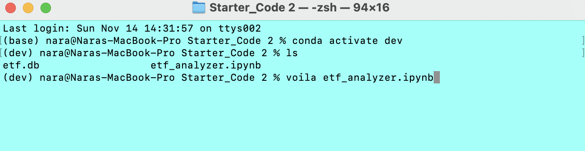
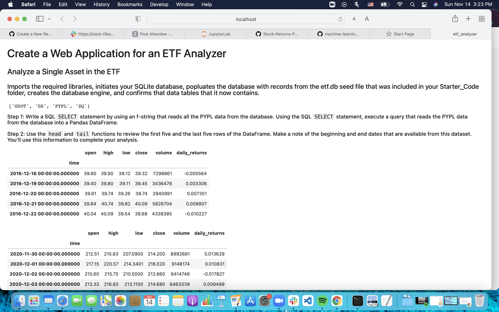

# ETF_analyzer-with-voila

    This repo helps build a financial database and web application by using SQL, Python, and the Voilà library to analyze the performance of a hypothetical fintech ETF.
    
    The analysis consists of following parts:
    
####  __1  Analyze a Single Asset in the ETF__

    
####  __2  Optimize Data Access with Advanced SQL Queries__

####  __3  Analyze the ETF Portfolio__

####  __4  Deploy the Notebook as a Web Application using Voilà__

    

---

## Technologies

JupyterLab web application

This project leverages python 3.7 with the following packages:

[pandas](https://github.com/pandas-dev) 

* __numpy__ to install it run the following comand in the Terminal

        -- pip install numpy

 
* __sqlalchemy__ to install it run the following comand in the Terminal

        -- pip install SQLAlchemy

* __voila__ to install it run the following comand in the Terminal

        -- conda install -c conda-forge voila

---

## Usage

To use the __ETF_Analyzer-with-voila__ 

clone the repository, open it with Jupyterlab and then run the following command in the Terminal
        
            -- voila etf_analyzer.ipynb

## Contributors

    UC Berkley
---
## License

    

